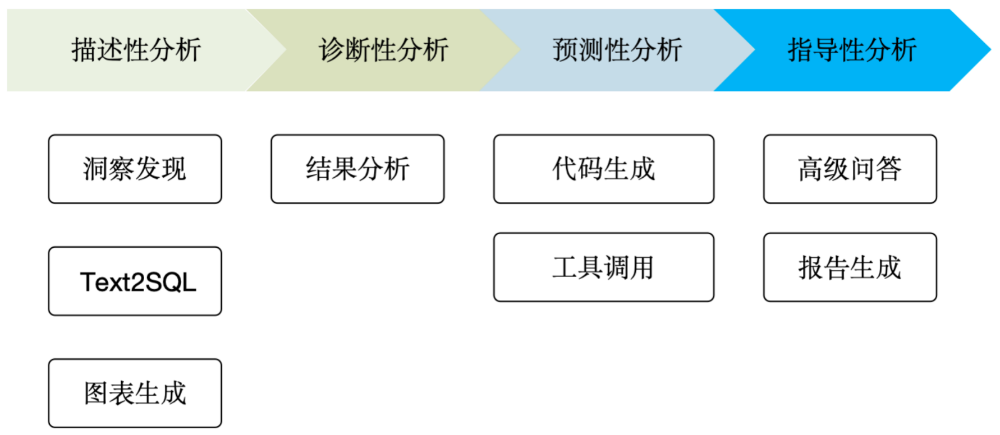
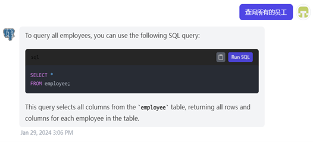
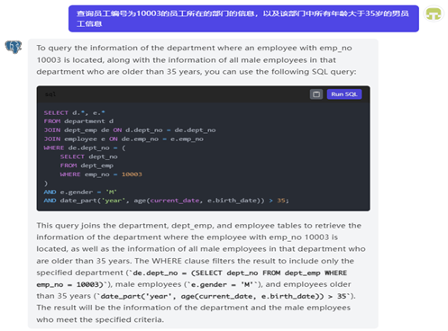
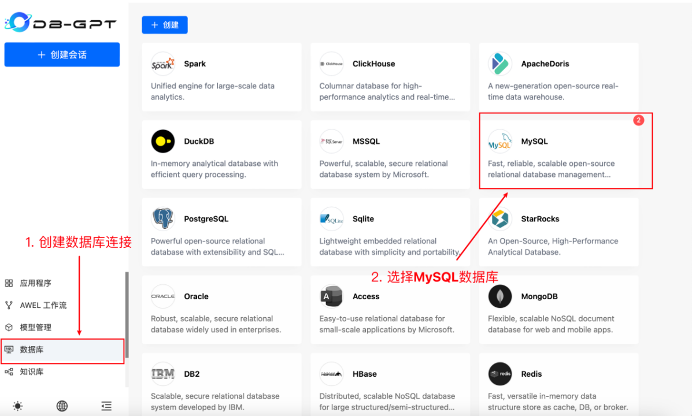
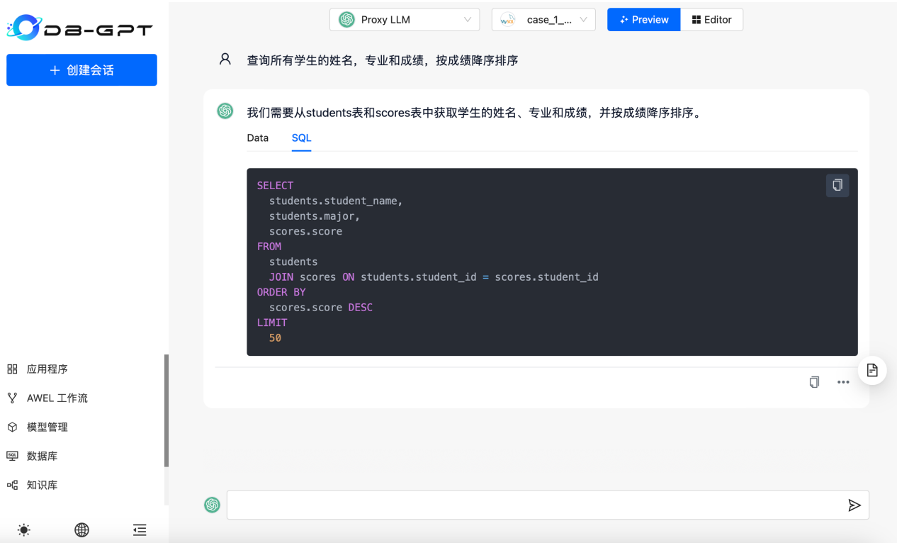
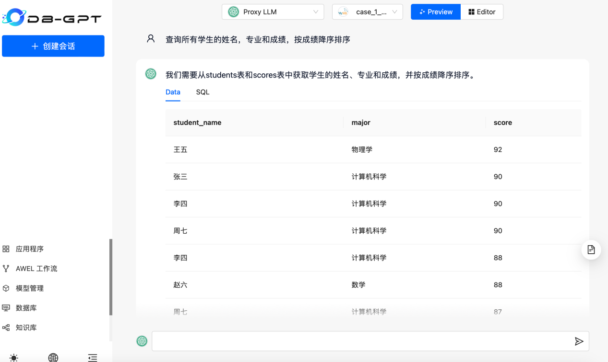
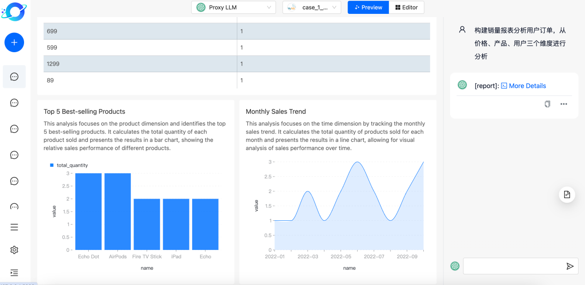
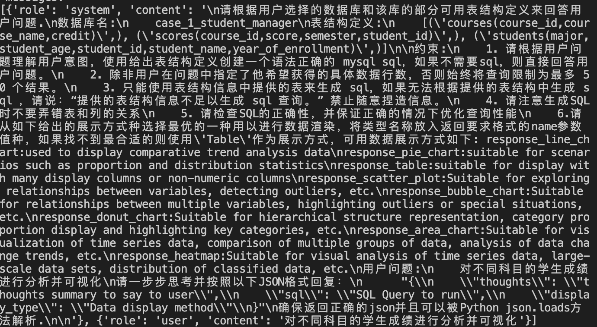
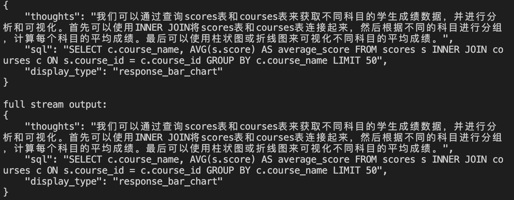

# LLM4DB教学  
## LLM4DB Learning
本项目是将大模型技术融入数据库课程教育的一次实践。
项目内容基于传统数据库课程教学内容，融入大模型技术，
指导学生学会如何将大模型技术用于数据库开发使用。

- [LLM4DB](#llm4db)
  - [项目背景](#项目背景)
  - [项目章节](#项目章节)
    - [数据库设计](#数据库设计)
      - [数据模型](#数据模型)
      - [实体关系图(ER图)](#实体关系图er图)
      - [设计范式理论](#设计范式理论)
    - [查询接口](#查询接口)
      - [Text2SQL](#Text2SQL)
      - [数据分析](#数据分析)
    <!-- - [向量检索\&增强LLM](#向量检索增强llm) -->
    - [数据库维护](#数据库维护)
  - [相关学术论文](#相关学术论文)
    - [数据库设计](#数据库设计-1)
      - [DB-GPT:Large Language Model Meets Database](#db-gptlarge-language-model-meets-database)
    - [查询接口](#查询接口-1)
      - [LLM4Text2SQL](#LLM4Text2SQL)
    <!-- - [向量检索\&增强LLM](#向量检索增强llm-1) -->
    - [数据库维护](#数据库维护-1)
  - [实验设计](#实验设计)
    - [大模型辅助ER图设计优化](#大模型辅助er图设计优化)
    - [大模型Text2SQL实践](#大模型Text2SQL实践)
  - [联系我们](#联系我们)


## [项目背景](#项目背景)
数据库课程作为计算机专业的核心课程，对于培养学生的信息处理能力和解决实际问题的能力起着关键作用。随着大模型技术的快速发展，大模型在更行各业都展现出了巨大的潜力。大模型作为一种强大的自然语言处理工具，不仅可以协助我们理解和处理海量的数据，也为我们的数据可以教育带来了全新的可能性。

因此我们考虑将大模型基于融入数据库课程，希望能够推动数据库教育的创新，为教师提供更多优质的教学资源，为学生提供更具挑战性和实用性的学习机会。


## [项目章节](#项目章节)

### [数据库设计](#数据库设计_章节)
#### [数据模型](#数据模型_章节)
数据模型是用于描述现实世界中数据的抽象工具。它提供了一种结构化的方式来组织和表示数据，使得数据库系统能够有效地存储、检索和操作数据。数据模型可以看作是数据库中数据的蓝图，它定义了数据的结构、关系和约束条件。

在数据库设计过程中，复杂数据模型的生成可能会面临一些挑战，例如处理大量数据、满足复杂的业务需求等。近年来随着大模型技术的出现与成熟，借助大模型辅助生成复杂数据模型成为了一种可行解决方案，DB-GPT[1]尝试将大模型用于数据库构建与管理，DB-GPT可以理解自然语言查询语句，生成准确高效的SQL语句并执行。大模型能够理解和分析大量的文本数据，并生成高质量的自然语言文本，可以用于辅助设计和生成复杂数据模型的过程。

使用大模型辅助生成复杂数据模型的方法涉及以下步骤：

+ 数据需求分析：首先，需要对业务需求进行详细的分析，了解数据的特点、关系和约束条件。可以使用大模型辅助分析数据特性。PandasAI[4]是一个结合了大模型与Pandas的工具，可以利用它进行数据分析处理，如下图所示。


+ 数据模型设计：基于需求分析的结果，开始设计数据模型的结构、关系和属性。这可以涉及到概念建模、实体关系图、ER图等技术工具和方法。大模型可以辅助数据关系的建模，发掘数据间联系。利用大模型辅助数据关系建模将在3.2节详细介绍。
+ 数据模型描述：将设计好的数据模型转化为机器可理解的形式，例如使用领域特定语言（Domain-Specific Language，DSL）或类似的描述性语言。这些描述可以提供给大模型作为输入。例如，在绘制ER图时，可以采用plantuml描述ER图的内容。
+ 大模型辅助生成：将数据模型描述提供给大模型，利用其语言生成能力，辅助生成复杂数据模型的文档、代码或其他形式的表达。大模型可以根据输入的描述生成相关的数据模型设计，包括表结构、关系约束、索引等。
+ 评估和调整：生成的数据模型需要进行评估和调整，以确保满足业务需求和数据库设计原则。这可能需要与领域专家和数据库开发人员进行合作，对生成的模型进行验证和优化。

使用大模型进行数据模型生成的优势在于它能够加速设计过程、提供创造性的思路以及帮助发现隐藏的模式和关系。然而，需要注意的是，大模型生成的结果仍然需要人工的审查和调整，以确保生成的数据模型是合理、可行和有效的。

#### [实体关系图(ER图)](#实体关系图(ER图)_章节)
实体关系图（Entity-Relationship Diagram，简称ER图）是一种常用的数据库设计工具，用于描述现实世界中实体（Entity）之间的关系（Relationship）

基于大模型的ER图设计与优化是利用大模型的语言理解和生成能力来辅助数据库设计人员进行ER图的设计和优化工作。主要涉及以下步骤：
+ 数据模型理解：将现实世界的需求和场景转化为数据模型的表示。通过对现实世界的分析，识别实体、关系和属性，并进行定义和描述。
+ 初始ER图设计：根据数据模型的理解，进行初始的ER图设计。可以利用传统的ER图设计方法进行初步的设计，包括实体、关系和属性的定义，并绘制出初始的ER图。
+ 大模型辅助优化：利用大模型进行ER图的优化。将初始的ER图输入到大模型中，借助其语言理解和生成能力，获取针对性的优化建议和改进方案。
+ 优化决策原则策略：根据大模型提供的优化建议和改进方案，结合数据库设计人员的专业知识和经验，进行优化决策。在做出决策时，可以考虑以下原则策略：
  + 性能优化：根据大模型的建议，调整ER图以提高数据库的性能，如添加索引、优化关系表示等。
  + 数据一致性：确保ER图的设计能够满足数据的一致性要求，如定义适当的关系和约束条件。
  + 可扩展性：考虑数据库的可扩展性需求，如设计合适的关系和实体之间的关联，以支持未来的扩展和变化。

#### [设计范式理论](#设计范式理论_章节)
设计范式理论是数据库设计中的基本理论框架，旨在规范数据库模式的设计，确保数据库的结构和操作能够满足数据的一致性、完整性和可靠性要求。

设计范式理论的目标是通过规范化数据库模式，减少数据冗余、提高数据一致性和完整性，以及简化数据库操作和维护。然而，过度规范化也可能导致查询复杂性增加，影响性能。因此，在实际应用中，需要根据具体情况权衡设计范式和性能需求。

### [查询接口](#查询接口_章节)

#### [Text2SQL](#Text2SQL_章节)
随着数据库的发展，越来越多的用户在不同的领域会接触或使用数据库。为了能够让一些非专业人士使用数据库进行查询操作，越来越多的研究者开始关注如何将用户输入的自然语言文本转换为数据库可执行的SQL查询语句，即Text2SQL任务。

从技术范畴来看，Text2SQL任务的本质是将用户输入的自然语言文本转化为计算机可读懂、可运行、符合计算机规则的语义表示。这需要计算机能够理解自然语言，并生成能够准确表达语义的可执行的程序式语言。Text2SQL任务的定位属于语义分析领域的一个子任务。

Text2SQL的输入一般为数据库的schema（通常包含数据库中的所有表名和表中的所有列名）和自然语言描述的查询文本，而最终希望得到的结果是可执行的与自然语言描述对应的SQL查询，如下图所示。


该任务主要有三个难点。
- 如何对数据库schema中的各个关系进行编码，让模型能够学习到数据库各个表之间的关系。
- 如何对数据库schema与自然语言描述进行对齐，让模型能够学习到自然语言描述中的单词是对应数据库schema中哪个表或哪个列。
- 如何生成正确的可执行的SQL查询语句。

传统的Text2SQL模型通常会针对上述的三个难点，专门设计各种不同的模块。而在基于大语言模型的场景下，上述的难点可以借助大语言模型强大的语言理解能力和文本生成能力来进行解决。大语言模型可以有效理解用户输入的数据库schema并且严格生成符合SQL语法格式的结果。因此，大语言模型在Text2SQL任务上取得了优异的表现。现在，越来越多的研究者开始探索如何充分挖掘大语言模型的能力，更好的完成Text2SQL任务，其中具体应用和方法的分类如下图所示。


#### [数据分析](#数据分析_章节)


依托于大语言模型的高级对话能力和 Text2SQL 能力，用户可以通过自然语言形式的对话进行数据查询。在数据分析领域，数据分析师需要频繁地对数据库进行交互，而大语言模型的出现降低了用户数据库进行交互的门槛，越来越多基于大语言模型的高级应用被开发，可能颠覆传统数据分析的工作流程。

数据分析的过程由浅到深可以分为描述性、诊断性、预测性以及指导性分析。
<!-- 数据分析的过程由浅到深可以分为描述性、诊断性、预测性以及指导性分析。诊断性分析是数据分析的初级阶段，旨在客观地对数据进行总结和描述，以便更好地理解数据。诊断性分析的目的是确定数据问题，例如异常值和异常情况的发现。预测性分析是根据过去的数据预测未来的趋势和结果，而指导性分析是根据数据分析的结果为决策者提出建议和决策以实现商业业务目标。 -->
在大语言模型出现之前，大部分的人工智能方法只能触及描述性分析阶段，例如利用 Text2SQL 能力对数据库进行简单的基础查询。随着大语言模型的指令能力增强，多种数据分析中复杂任务实现已经可以成为可能，我们对这些任务进行了分类如图所示。


大模型辅助数据分析的主要手段包括

- 数据洞察 ：通过对数据集相关字段和定义进行初步分析，生成数据摘要，为用户在分析工作开始前提供更多有价值的信息
- Text2SQL ：对用户意图生成相应的 SQL 执行规划，推动数据分析过程，是实现数据分析任务的主要手段
- 数据可视化 ：对数据或查询结果绘制图表、提供更直观的可视化分析
- 代码生成 ：针对高级数据操作，例如回归预测分析等，生成相应的数据操作代码
- 外部工具调用：通过工具调用实现运行 Python 解释器、查询外部接口等更多复杂功能推动数据分析进程
- 结果分析 ：通过结果分析实现下一步分析动作，实现全自动化的数据分析智能体
- 报告生成 ：对整个数分流程结果进行汇总并总结，生成分析报告

[//]: # (### [向量检索&增强LLM]&#40;#向量检索&增强LLM_章节&#41;)

[//]: # (#### [向量检索]&#40;#向量检索&#41;)

[//]: # (传统的关系型数据库通常以表格形式存储数据，但对于向量数据，表格形式的存储并不适用。向量数据库是一种专门用于存储和检索向量数据的数据库系统。它是为了处理高维向量数据而设计的，常用于机器学习、计算机视觉和自然语言处理等领域。向量数据库通过使用特定的数据结构和索引技术，提供了高效的向量存储和查询功能。随着大模型的推广与应用，对于大量的非结构化数据需要可靠、安全、快速和可扩展的查询处理能力，推动了向量数据库的发展。)

[//]: # ()
[//]: # (向量数据库检索方法的核心是通过计算向量之间的相似度来实现查询。常用的相似度度量方法包括欧氏距离、余弦相似度和汉明距离等。这些相似度度量方法可以根据具体应用的需求选择。通常欧式距离用于图片检索，余弦用于人脸识别，内积多用于推荐，海明距离由于向量比较小，通常用于大规模视频检索场景。)

[//]: # ()
[//]: # (常见的向量数据库的应用场景是基于一个现有的数据候选集（dataset），需要对新来的一个或者多个数据进行查询（query），返回在数据候选集中与该查询最相似的Top K数据。最朴素的想法就是，每次来了一个新的查询数据（query），都遍历一遍数据候选集（dataset）里面的所有数据，计算出 query 与 dataset 中所有元素的相似度或者距离，然后精准地返回 Top K 相似的数据即可。但是当数据候选集特别大的时候，遍历一遍数据候选集里面的所有元素就会耗费过多的时间，其时间复杂度是O&#40;n&#41;，因此一般会使用近似最近邻搜索&#40;Approximate Nearest Neighbor Search, ANN&#41; 来加快其搜索速度，但是在精确率和召回率上面就会做出一定的牺牲。通常会用召回率（也通常叫精度）来评估向量检索的效果，对于给定的向量q，其在数据集上的K近邻为N，通过检索召回的K个近邻集合为M，可以表示为：)

[//]: # ()
[//]: # ($$ Recall=\frac{|N\cap M|}K $$)

[//]: # ()
[//]: # (其中召回率越接近100%代表索引效果越好。)

[//]: # ()
[//]: # (其中常见的ANN算法包括：)

[//]: # ()
[//]: # (+ 局部敏感哈希（Locality Sensitive Hashing，LSH）：LSH是一种经典的ANN算法，它通过将向量映射到哈希空间，并设计哈希函数使得相似的向量在哈希空间中具有较高的概率落在同一个桶中。LSH可以在常数时间内快速过滤掉大部分不相似的向量，从而加速ANN搜索。)

[//]: # (+ Random Projection &#40;RP&#41;：RP是一种基于随机投影的ANN算法。它通过将高维向量投影到低维空间，保持向量之间的相对距离，然后在低维空间中进行ANN搜索。RP算法简单高效，适用于高维数据集。)

[//]: # (+ KDTree：KDTree是一种树结构的ANN算法。它通过将向量空间递归地划分为多个超矩形区域，构建一个二叉树结构。KDTree可以快速定位最近邻点，并支持范围搜索。但在高维空间中，KDTree的效果可能不如其他算法。)

[//]: # (+ Ball Tree：将数据点划分为一系列嵌套的球体。每个节点都定义了一个D维球体，包含了一部分待搜索的点。每个内部节点都将数据点划分为两个不相交的集合。)

[//]: # (+ 基于图的方法：通过构建图来表示数据集中的向量之间的关系，并利用图的结构进行高效的相似性搜索。其中GNNS算法基于图的结构进行ANN搜索。它首先根据数据集中的向量构建一个图，其中每个向量表示图的一个节点。然后，通过计算节点之间的相似度或距离，建立边连接节点。在查询时，可以使用图上的遍历算法（如广度优先搜索或深度优先搜索）来寻找最近邻节点。GNNS算法可以在图的结构中快速找到与查询向量相似的节点，从而进行ANN搜索。HNSW是一种基于图的ANN算法，它构建了一个层次化的图结构。在HNSW中，每个节点都连接到一组相似的节点，并且这些节点按照层次结构组织。在构建过程中，HNSW使用随机选择和局部搜索来保证图的稠密性和连通性。在查询时，可以通过在图的层次结构中进行快速搜索来找到最近邻节点。HNSW算法具有较好的搜索性能和可扩展性，适用于大规模数据集。)

[//]: # (+ Product Quantization &#40;PQ&#41;：PQ是一种基于向量量化的ANN算法。它将高维向量划分为多个子向量，并使用聚类算法将子向量量化为离散码本。在ANN搜索时，可以通过比较离散码本之间的距离来加速搜索。)

[//]: # ()
[//]: # (#### [检索增强生成LLM]&#40;#检索增强生成LLM&#41;)

[//]: # ("Retrieval-augmented generation" &#40;RAG&#41; 是一种结合了检索和生成的方法，旨在提高大型模型如ChatGPT的性能。虽然大型生成模型在创造性的生成任务上表现出色，但它们有时可能在记忆和准确性方面受限。RAG 通过引入检索模型，允许系统从已知的知识库中提取信息，以更准确、可靠地回答用户的问题或生成相关的文本。)

[//]: # ()
[//]: # (以下是RAG在ChatGPT等大型模型背景下的一些重要意义：)

[//]: # (+ 提高信息准确性：RAG可以通过检索模型访问大量的外部知识，从而提高生成模型对于问题的准确回答。这对于需要特定领域知识或准确信息的任务特别有效。)

[//]: # (+ 扩展模型的知识范围：大型生成模型在训练时学到了广泛的语言模式，但它们不能访问外部知识库。RAG允许模型在生成文本时利用外部知识，从而扩展其知识范围。)

[//]: # (+ 解决生成模型的记忆问题：生成模型有时可能会在长期依赖或需要记忆特定信息的任务上表现不佳。通过结合检索，RAG可以克服这些记忆方面的局限性。)

[//]: # (+ 提高对话质量：在聊天应用中，RAG可以通过检索先前的对话历史来更好地理解上下文，从而提高对话的一致性和连贯性。)

[//]: # ()
[//]: # (朴素的RAG主要在三个方面面临挑战：检索质量、回应生成质量和增强过程。)

[//]: # (+ 检索质量： 该方面的问题多方面。最主要的问题是低精度，即检索集中的文档块并不都与查询内容相关，这可能导致信息错误或不连贯。其次是低召回率问题，即未能检索到所有相关的文档块，使得大语言模型无法获取足够的背景信息来合成答案。此外，过时信息也是一个挑战，因为数据冗余或过时可能导致检索结果不准确。)

[//]: # (+ 回应生成质量： 这方面的问题同样多样。最突出的问题是制造错误信息，即模型在缺乏足够上下文的情况下虚构答案。另一个问题是回答不相关，即模型生成的答案未能针对查询问题。进一步来说，生成有害或偏见性回应也是一个问题。)

[//]: # (+ 增强过程：最终，增强过程面临几个重要挑战。特别重要的是，如何将检索到的文段的上下文有效融入当前的生成任务。如果处理不得当，生成的内容可能显得杂乱无章。当多个检索到的文段包含相似信息时，冗余和重复成为问题，这可能导致生成内容的重复。此外，如何判断多个检索到的文段对生成任务的重要性或相关性非常有挑战性，增强过程需要恰当地评估每个文段的价值。检索到的内容可能具有不同的写作风格或语调，增强过程需调和这些差异，以确保最终输出的一致性。最后，生成模型可能会过度依赖于增强信息，导致生成的内容仅是重复检索到的信息，而缺乏新的价值或综合信息。)

[//]: # ()
[//]: # (...)

### [数据库维护](#数据库维护_章节)

...

## [相关学术论文](#相关学术论文)

### [数据库设计](#数据库设计_论文)
#### [DB-GPT:Large Language Model Meets Database](https://link.springer.com/article/10.1007/s41019-023-00235-6)
利用大语言模型(Large language model， LLM)优化数据库存在几个挑战。首先，如何提供适当的prompt使LLM能够理解数据库优化问题。其次，LLMs只捕获逻辑数据库字符(例如，SQL语义)，但不知道物理字符(例如，数据分布)，需要优化LLMs来捕获物理和逻辑信息。第三，对于具有严格约束和隐私保护需求的数据库，LLM没有经过良好的训练，在确保数据库隐私的同时训练特定于数据库的LLM是一项挑战。为了克服这些挑战，本文提出了一个基于LLM的数据库框架(DB-GPT)，包括自动提示生成、特定于数据库的模型微调、模型设计和预训练。


### [查询接口](#查询接口_论文)
#### [LLM4Text2SQL](#Text2SQL论文)
- [A comprehensive evaluation of ChatGPT's zero-shot Text-to-SQL capability](https://arxiv.org/pdf/2303.13547.pdf)
- [Exploring Chain-of-Thought Style Prompting for Text-to-SQL](https://arxiv.org/pdf/2305.14215.pdf)
- [LLM-SQL-Solver: Can LLMs Determine SQL Equivalence?](https://arxiv.org/pdf/2312.10321.pdf)
- [Using LLM to select the right SQL Query from candidates](https://arxiv.org/pdf/2401.02115.pdf)
- [DBCopilot: Scaling Natural Language Querying to Massive Databases](https://arxiv.org/pdf/2312.03463.pdf)
- [Can llm already serve as a database interface? a big bench for large-scale database grounded text-to-sqls](https://arxiv.org/pdf/2305.03111.pdf)

#### [数据分析](#数据分析_论文)
- [InsightPilot: An LLM-Empowered Automated Data Exploration System](https://aclanthology.org/2023.emnlp-demo.31.pdf)
- [JarviX: A LLM No code Platform for Tabular Data Analysis and Optimization](https://aclanthology.org/2023.emnlp-industry.59.pdf)
- [DB-GPT: Empowering Database Interactions with Private Large Language Models](https://arxiv.org/pdf/2312.17449.pdf)
- [ChatDB: Augmenting LLMs with Databases as Their Symbolic Memory
](https://arxiv.org/pdf/2306.03901.pdf)
- [Text2Analysis: A Benchmark of Table Question Answering with Advanced Data Analysis and Unclear Queries](https://ojs.aaai.org/index.php/AAAI/article/view/29779/31344)
- [OpenAgents: An Open Platform for Language Agents in the Wild](https://arxiv.org/pdf/2310.10634.pdf)


[//]: # (### [向量检索&检索增强LLM]&#40;#向量检索&增强LLM_论文&#41;)

[//]: # (#### [向量检索]&#40;#向量检索论文&#41;)

[//]: # (- [Survey of Vector Database Management Systems]&#40;https://arxiv.org/pdf/2310.14021.pdf&#41;)

[//]: # (- [A survey on locality sensitive hashing algorithms and their applications]&#40;https://arxiv.org/pdf/2102.08942.pdf&#41;)

[//]: # (- [K-d trees for semidynamic point sets]&#40;https://dl.acm.org/doi/pdf/10.1145/98524.98564&#41;)

[//]: # (- [Approximate nearest neighbor algorithm based on navigable small world graphs]&#40;https://www.sciencedirect.com/science/article/abs/pii/S0306437913001300&#41;)

[//]: # (- [Optimized product quantization]&#40;https://ieeexplore.ieee.org/abstract/document/6678503&#41;)

[//]: # (- [Learning Balanced Tree Indexes for Large-Scale Vector Retrieval]&#40;https://dl.acm.org/doi/abs/10.1145/3580305.3599406&#41;)

[//]: # (#### [检索增强LLM]&#40;#检索增强LLM&#41;)

[//]: # (- [Retrieval-augmented generation for large language models]&#40;https://arxiv.org/pdf/2312.10997.pdf&#41;)

[//]: # (- [Retrieve anything to augment large language models]&#40;https://arxiv.org/pdf/2310.07554.pdf&#41;)

[//]: # (- [Augmenting Language Models with Long-Term Memory]&#40;https://proceedings.neurips.cc/paper_files/paper/2023/file/ebd82705f44793b6f9ade5a669d0f0bf-Paper-Conference.pdf&#41;)

[//]: # (- [GPTCache: An Open-Source Semantic Cache for LLM Applications Enabling Faster Answers and Cost Savings]&#40;https://aclanthology.org/2023.nlposs-1.24.pdf&#41;)

### [数据库维护](#数据库维护_论文)

...

## [实验设计](#实验设计)
### [大模型辅助ER图设计优化](#大模型辅助ER图设计优化_实验)
现在需要为一个学生选课系统设计一个数据管理系统。
该系统有若干名学生，每个学生有学号，姓名等信息。
该系统有若干门课程，每一门课程有课程号，课程名，教师等信息。

（1）首先我们先进行数据模型的初步理解，需要构建三张表，学生表，课程表以及学生选课表。
* 学生表 S（SNO，SNAME），其属性表示学生的学号和姓名。
* 课程表 C（CNO，CNAME，TEACHER），其属性表示课程号、课程名称和教师。
* 学生选课表 SC（SNO，CNO，GRADE），其属性表示学生的学号、所学课程的课程号和成绩。

（2）基于数据模型的理解，我们利用PlantUML绘制出初步的ER图，如下图所示。PlantUML代码如下：
```
@startuml

entity "S" as S {
  + SNO (PK) : INT
  SNAME : VARCHAR(50)
}

entity "C" as C {
  + CNO (PK) : INT
  CNAME : VARCHAR(50)
  TEACHER : VARCHAR(50)
}

entity "SC" as SC {
  + SNO (PK, FK) : INT
  + CNO (PK, FK) : INT
  GRADE : INT
}

S ||--o{ SC
C ||--o{ SC

@enduml
```


（3）将ER图的PlantUML代码输入大模型（如ChatGPT），要求它进行优化。优化后的ER图如下图所示，以下是ChatGPT对ER图优化后的代码：

```
@startuml

!define Table(name,desc) class name as "desc" << (T,#FFAAAA) >>
!define PrimaryKey(x) <u>x</u>
!define ForeignKey(x) <i>x</i>
!define NotNull(x) <b>x</b>
!define AutoIncrement(x) <color:green>x</color>

hide stereotype

Table(S, "Students") {
  - PrimaryKey(SNO) : INT
  - NotNull(SNAME) : VARCHAR(50)
}

Table(C, "Courses") {
  - PrimaryKey(CNO) : INT
  - NotNull(CNAME) : VARCHAR(50)
  - NotNull(TEACHER) : VARCHAR(50)
}

Table(SC, "StudentCourses") {
  - ForeignKey(SNO) : INT
  - ForeignKey(CNO) : INT
  - NotNull(GRADE) : INT
}

S -- SC
C -- SC

@enduml
```


可以发现，大模型对变量命名、ER图表示、主外键等进行了修改优化，优化后的ER图更加直观、易于理解。

（4）考虑到系统的可拓展性等方面，我们对经过大模型优化后的ER图添加一些属性。最终ER图如下所示。


### [大模型Text2SQL实践](#大模型Text2SQL实践)
我们以开源项目[SQL Chat](https://github.com/sqlchat/sqlchat)为例，介绍如何通过与大模型对话的方式查询数据库中的信息。

首先，进入SQL Chat的[demo](https://www.sqlchat.ai/)页面，选择项目准备好的示例数据库(sample-employee)，该数据库中包含6张表。

然后，可以先尝试使用自然语言与大模型进行交互，进行一些比较简单的查询。比如，如下图所示，我们输入“查询所有的员工”。大模型返回了对应的SQL语句并且提供了相应的解释。通过点击Run SQL按钮，我们可以直接在数据库运行大模型生成的SQL语句，得到对应的查询结果。



接下来，我们可以开始尝试让大模型完成一些较为复杂的查询任务。比如，如下图所示，我们输入“查询员工编号为10003的员工所在的部门的信息，以及该部门中所有年龄大于35岁的男员工信息”，并同样得到了大模型返回的SQL语句。通过进一步执行该SQL查询，我们发现大模型生成的SQL语句依然是正确的。这说明即使是较为复杂的查询需求， 大模型也可以返回正确的结果，验证了大模型强大的Text2SQL能力。



最后，我们还可以尝试自己编写Prompt，进一步探索如何更好的激发大语言模型的Text2SQL能力。

### [大模型数据分析实践](#大模型数据分析实践)

介绍如何结合 MySQL 数据库、 ChatGPT 以及开源数据分析系统 [DB-GPT](https://github.com/eosphoros-ai/DB-GPT) 低成本利用大语言模型帮助实现数据分析工作。

下载 DB-GPT 的源码之后，复制工程目录下的 .env.template 模版文件并命名为 .env 文件，并修改该文件的环境变量，填入所使用的大模型类型， API 密钥信息以及MySQL 数据库连接信息。之后导入项目自带的示例数据库数据。

启动系统后，添加要访问的数据库连接，在侧边栏选择数据库并在候选卡片中选择 MySQL，输入连接名称、用户名、密码等完成设置。


数据库连接创建好后我们就可以进行数据分析工作。首先可以对最基本的 Text2SQL 能力进行测试。输入“查询所有学生的姓名，专业和成绩，按成绩降序排序”，大语言模型给出了对问题的思考过程以及 SQL，系统运行 SQL 给出执行结果。




进一步地，DB-GPT 还可以对查询结果进行图表生成，只需要在提问时告知模型需要进行可视化。下图展示了一个对电商场景数据库中对各商品销量进行查询并从多角度构建商务报表的例子。




最后可以从后端启动的命令行中查看 DB-GPT 如何从用户输入中构建合理的指令指令提示，以及大语言模型的原始返回结果。这些步骤有助于帮助了解系统背后的运行过程。




## [联系我们](#联系我们)
- 蔡琰 Email：51255901104@stu.ecnu.edu.cn
