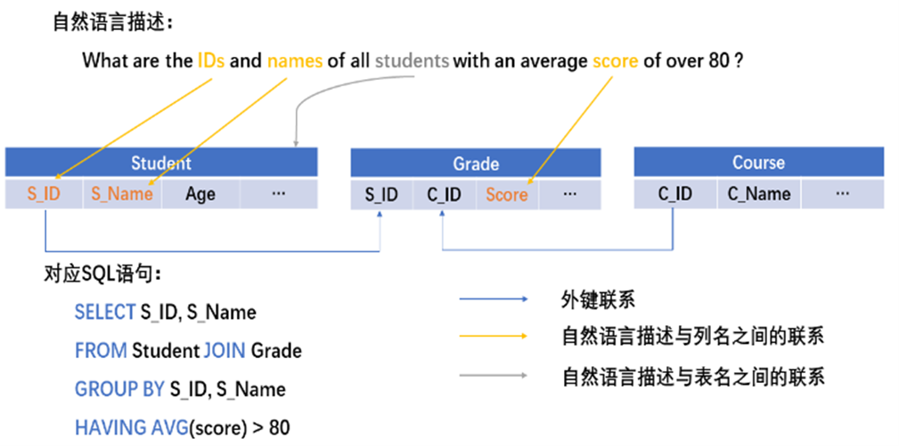
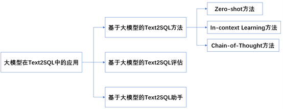
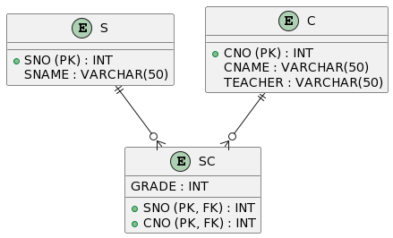
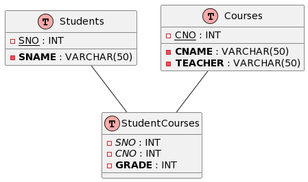
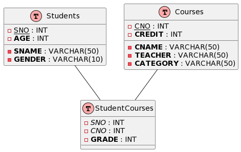

# LLM4DB
本项目是将大模型技术融入数据库课程教育的一次实践。
项目内容基于传统数据库课程教学内容，融入大模型技术，
指导学生学会如何将大模型技术用于数据库开发使用。

- [LLM4DB](#llm4db)
  - [项目背景](#项目背景)
  - [项目章节](#项目章节)
    - [数据库设计](#数据库设计)
      - [数据模型](#数据模型)
      - [实体关系图(ER图)](#实体关系图er图)
      - [设计范式理论](#设计范式理论)
    - [查询接口](#查询接口)
      - [Text2SQL](#Text2SQL)
    - [向量检索\&增强LLM](#向量检索增强llm)
    - [数据库维护](#数据库维护)
  - [相关学术论文](#相关学术论文)
    - [数据库设计](#数据库设计-1)
      - [DB-GPT:Large Language Model Meets Database](#db-gptlarge-language-model-meets-database)
    - [查询接口](#查询接口-1)
      - [LLM4Text2SQL](#LLM4Text2SQL)
    - [向量检索\&增强LLM](#向量检索增强llm-1)
    - [数据库维护](#数据库维护-1)
  - [实验设计](#实验设计)
    - [大模型辅助ER图设计优化](#大模型辅助er图设计优化)
  - [联系我们](#联系我们)


## [项目背景](#项目背景)
数据库课程作为计算机专业的核心课程，对于培养学生的信息处理能力和解决实际问题的能力起着关键作用。随着大模型技术的快速发展，大模型在更行各业都展现出了巨大的潜力。大模型作为一种强大的自然语言处理工具，不仅可以协助我们理解和处理海量的数据，也为我们的数据可以教育带来了全新的可能性。

因此我们考虑将大模型基于融入数据库课程，希望能够推动数据库教育的创新，为教师提供更多优质的教学资源，为学生提供更具挑战性和实用性的学习机会。


## [项目章节](#项目章节)

### [数据库设计](#数据库设计_章节)
#### [数据模型](#数据模型_章节)
数据模型是用于描述现实世界中数据的抽象工具。它提供了一种结构化的方式来组织和表示数据，使得数据库系统能够有效地存储、检索和操作数据。数据模型可以看作是数据库中数据的蓝图，它定义了数据的结构、关系和约束条件。

在数据库设计过程中，复杂数据模型的生成可能会面临一些挑战，例如处理大量数据、满足复杂的业务需求等。近年来随着大模型技术的出现与成熟，借助大模型辅助生成复杂数据模型成为了一种可行解决方案，DB-GPT[1]尝试将大模型用于数据库构建与管理，DB-GPT可以理解自然语言查询语句，生成准确高效的SQL语句并执行。大模型能够理解和分析大量的文本数据，并生成高质量的自然语言文本，可以用于辅助设计和生成复杂数据模型的过程。

使用大模型辅助生成复杂数据模型的方法涉及以下步骤：

+ 数据需求分析：首先，需要对业务需求进行详细的分析，了解数据的特点、关系和约束条件。可以使用大模型辅助分析数据特性。PandasAI[4]是一个结合了大模型与Pandas的工具，可以利用它进行数据分析处理，如下图所示。


+ 数据模型设计：基于需求分析的结果，开始设计数据模型的结构、关系和属性。这可以涉及到概念建模、实体关系图、ER图等技术工具和方法。大模型可以辅助数据关系的建模，发掘数据间联系。利用大模型辅助数据关系建模将在3.2节详细介绍。
+ 数据模型描述：将设计好的数据模型转化为机器可理解的形式，例如使用领域特定语言（Domain-Specific Language，DSL）或类似的描述性语言。这些描述可以提供给大模型作为输入。例如，在绘制ER图时，可以采用plantuml描述ER图的内容。
+ 大模型辅助生成：将数据模型描述提供给大模型，利用其语言生成能力，辅助生成复杂数据模型的文档、代码或其他形式的表达。大模型可以根据输入的描述生成相关的数据模型设计，包括表结构、关系约束、索引等。
+ 评估和调整：生成的数据模型需要进行评估和调整，以确保满足业务需求和数据库设计原则。这可能需要与领域专家和数据库开发人员进行合作，对生成的模型进行验证和优化。

使用大模型进行数据模型生成的优势在于它能够加速设计过程、提供创造性的思路以及帮助发现隐藏的模式和关系。然而，需要注意的是，大模型生成的结果仍然需要人工的审查和调整，以确保生成的数据模型是合理、可行和有效的。

#### [实体关系图(ER图)](#实体关系图(ER图)_章节)
实体关系图（Entity-Relationship Diagram，简称ER图）是一种常用的数据库设计工具，用于描述现实世界中实体（Entity）之间的关系（Relationship）

基于大模型的ER图设计与优化是利用大模型的语言理解和生成能力来辅助数据库设计人员进行ER图的设计和优化工作。主要涉及以下步骤：
+ 数据模型理解：将现实世界的需求和场景转化为数据模型的表示。通过对现实世界的分析，识别实体、关系和属性，并进行定义和描述。
+ 初始ER图设计：根据数据模型的理解，进行初始的ER图设计。可以利用传统的ER图设计方法进行初步的设计，包括实体、关系和属性的定义，并绘制出初始的ER图。
+ 大模型辅助优化：利用大模型进行ER图的优化。将初始的ER图输入到大模型中，借助其语言理解和生成能力，获取针对性的优化建议和改进方案。
+ 优化决策原则策略：根据大模型提供的优化建议和改进方案，结合数据库设计人员的专业知识和经验，进行优化决策。在做出决策时，可以考虑以下原则策略：
  + 性能优化：根据大模型的建议，调整ER图以提高数据库的性能，如添加索引、优化关系表示等。
  + 数据一致性：确保ER图的设计能够满足数据的一致性要求，如定义适当的关系和约束条件。
  + 可扩展性：考虑数据库的可扩展性需求，如设计合适的关系和实体之间的关联，以支持未来的扩展和变化。

#### [设计范式理论](#设计范式理论_章节)
设计范式理论是数据库设计中的基本理论框架，旨在规范数据库模式的设计，确保数据库的结构和操作能够满足数据的一致性、完整性和可靠性要求。

设计范式理论的目标是通过规范化数据库模式，减少数据冗余、提高数据一致性和完整性，以及简化数据库操作和维护。然而，过度规范化也可能导致查询复杂性增加，影响性能。因此，在实际应用中，需要根据具体情况权衡设计范式和性能需求。

### [查询接口](#查询接口_章节)

#### [Text2SQL](#Text2SQL_章节)
随着数据库的发展，越来越多的用户在不同的领域会接触或使用数据库。为了能够让一些非专业人士使用数据库进行查询操作，越来越多的研究者开始关注如何将用户输入的自然语言文本转换为数据库可执行的SQL查询语句，即Text2SQL任务。

从技术范畴来看，Text2SQL任务的本质是将用户输入的自然语言文本转化为计算机可读懂、可运行、符合计算机规则的语义表示。这需要计算机能够理解自然语言，并生成能够准确表达语义的可执行的程序式语言。Text2SQL任务的定位属于语义分析领域的一个子任务。

Text2SQL的输入一般为数据库的schema（通常包含数据库中的所有表名和表中的所有列名）和自然语言描述的查询文本，而最终希望得到的结果是可执行的与自然语言描述对应的SQL查询，如下图所示。


该任务主要有三个难点。
- 如何对数据库schema中的各个关系进行编码，让模型能够学习到数据库各个表之间的关系。
- 如何对数据库schema与自然语言描述进行对齐，让模型能够学习到自然语言描述中的单词是对应数据库schema中哪个表或哪个列。
- 如何生成正确的可执行的SQL查询语句。

传统的Text2SQL模型通常会针对上述的三个难点，专门设计各种不同的模块。而在基于大语言模型的场景下，上述的难点可以借助大语言模型强大的语言理解能力和文本生成能力来进行解决。大语言模型可以有效理解用户输入的数据库schema并且严格生成符合SQL语法格式的结果。因此，大语言模型在Text2SQL任务上取得了优异的表现。现在，越来越多的研究者开始探索如何充分挖掘大语言模型的能力，更好的完成Text2SQL任务，其中具体应用和方法的分类如下图所示。



...

### [向量检索&增强LLM](#向量检索&增强LLM_章节)

...

### [数据库维护](#数据库维护_章节)

...

## [相关学术论文](#相关学术论文)

### [数据库设计](#数据库设计_论文)
#### [DB-GPT:Large Language Model Meets Database](https://link.springer.com/article/10.1007/s41019-023-00235-6)
利用大语言模型(Large language model， LLM)优化数据库存在几个挑战。首先，如何提供适当的prompt使LLM能够理解数据库优化问题。其次，LLMs只捕获逻辑数据库字符(例如，SQL语义)，但不知道物理字符(例如，数据分布)，需要优化LLMs来捕获物理和逻辑信息。第三，对于具有严格约束和隐私保护需求的数据库，LLM没有经过良好的训练，在确保数据库隐私的同时训练特定于数据库的LLM是一项挑战。为了克服这些挑战，本文提出了一个基于LLM的数据库框架(DB-GPT)，包括自动提示生成、特定于数据库的模型微调、模型设计和预训练。


### [查询接口](#查询接口_论文)
#### [LLM4Text2SQL](#Text2SQL论文)
- [A comprehensive evaluation of ChatGPT's zero-shot Text-to-SQL capability](https://arxiv.org/pdf/2303.13547.pdf)
- [Exploring Chain-of-Thought Style Prompting for Text-to-SQL](https://arxiv.org/pdf/2305.14215.pdf)
- [LLM-SQL-Solver: Can LLMs Determine SQL Equivalence?](https://arxiv.org/pdf/2312.10321.pdf)
- [Using LLM to select the right SQL Query from candidates](https://arxiv.org/pdf/2401.02115.pdf)
- [DBCopilot: Scaling Natural Language Querying to Massive Databases](https://arxiv.org/pdf/2312.03463.pdf)
- [Can llm already serve as a database interface? a big bench for large-scale database grounded text-to-sqls](https://arxiv.org/pdf/2305.03111.pdf)

...

### [向量检索&增强LLM](#向量检索&增强LLM_论文)

...

### [数据库维护](#数据库维护_论文)

...

## [实验设计](#实验设计)
### [大模型辅助ER图设计优化](#大模型辅助ER图设计优化_实验)
现在需要为一个学生选课系统设计一个数据管理系统。
该系统有若干名学生，每个学生有学号，姓名等信息。
该系统有若干门课程，每一门课程有课程号，课程名，教师等信息。

（1）首先我们先进行数据模型的初步理解，需要构建三张表，学生表，课程表以及学生选课表。
* 学生表 S（SNO，SNAME），其属性表示学生的学号和姓名。
* 课程表 C（CNO，CNAME，TEACHER），其属性表示课程号、课程名称和教师。
* 学生选课表 SC（SNO，CNO，GRADE），其属性表示学生的学号、所学课程的课程号和成绩。

（2）基于数据模型的理解，我们利用PlantUML绘制出初步的ER图，如下图所示。PlantUML代码如下：
```
@startuml

entity "S" as S {
  + SNO (PK) : INT
  SNAME : VARCHAR(50)
}

entity "C" as C {
  + CNO (PK) : INT
  CNAME : VARCHAR(50)
  TEACHER : VARCHAR(50)
}

entity "SC" as SC {
  + SNO (PK, FK) : INT
  + CNO (PK, FK) : INT
  GRADE : INT
}

S ||--o{ SC
C ||--o{ SC

@enduml
```



（3）将ER图的PlantUML代码输入大模型（如ChatGPT），要求它进行优化。优化后的ER图如下图所示，以下是ChatGPT对ER图优化后的代码：

```
@startuml

!define Table(name,desc) class name as "desc" << (T,#FFAAAA) >>
!define PrimaryKey(x) <u>x</u>
!define ForeignKey(x) <i>x</i>
!define NotNull(x) <b>x</b>
!define AutoIncrement(x) <color:green>x</color>

hide stereotype

Table(S, "Students") {
  - PrimaryKey(SNO) : INT
  - NotNull(SNAME) : VARCHAR(50)
}

Table(C, "Courses") {
  - PrimaryKey(CNO) : INT
  - NotNull(CNAME) : VARCHAR(50)
  - NotNull(TEACHER) : VARCHAR(50)
}

Table(SC, "StudentCourses") {
  - ForeignKey(SNO) : INT
  - ForeignKey(CNO) : INT
  - NotNull(GRADE) : INT
}

S -- SC
C -- SC

@enduml
```



可以发现，大模型对变量命名、ER图表示、主外键等进行了修改优化，优化后的ER图更加直观、易于理解。

（4）考虑到系统的可拓展性等方面，我们对经过大模型优化后的ER图添加一些属性。最终ER图如下所示。



## [联系我们](#联系我们)
- 蔡琰 Email：51255901104@stu.ecnu.edu.cn
